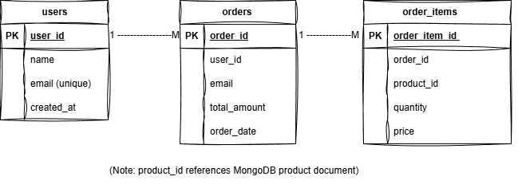
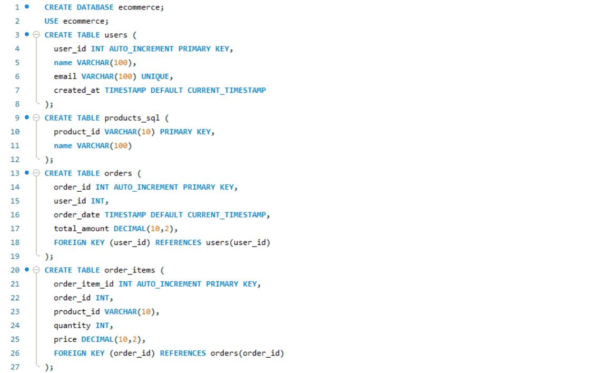
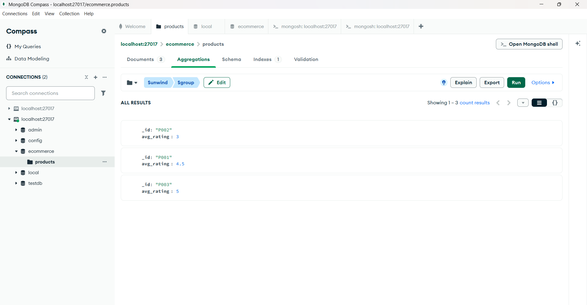

# Hybrid E-Commerce Database System Using MySQL and MongoDB  
### M605 – Advanced Databases  
### Student: Tomik Gujarati | Student ID: GH1026955  

---

## 📌 Project Overview  
This project demonstrates a **hybrid SQL + NoSQL database architecture** suitable for modern e-commerce applications.  
It integrates:

- **MySQL** → for structured, transactional data  
- **MongoDB** → for flexible product documents and embedded reviews  
- **Python Integration Layer** → to connect and exchange data across both databases  

This architecture reflects real-world systems used by Amazon, Flipkart, Shopify, and other modern platforms.

---

## 📂 Folder Structure  

This project demonstrates a hybrid database architecture using **MySQL** for transactional data and **MongoDB** for flexible product data.

Below are the screenshots for the ER diagram and example outputs.

---

## ER Diagram

---

## MySQL Screenshots

### Tables

### JOIN Query Output

### Aggregation Query Output

---

## MongoDB Screenshots

### Product Documents

### Aggregation Pipeline Output

---

## Python Integration Output

