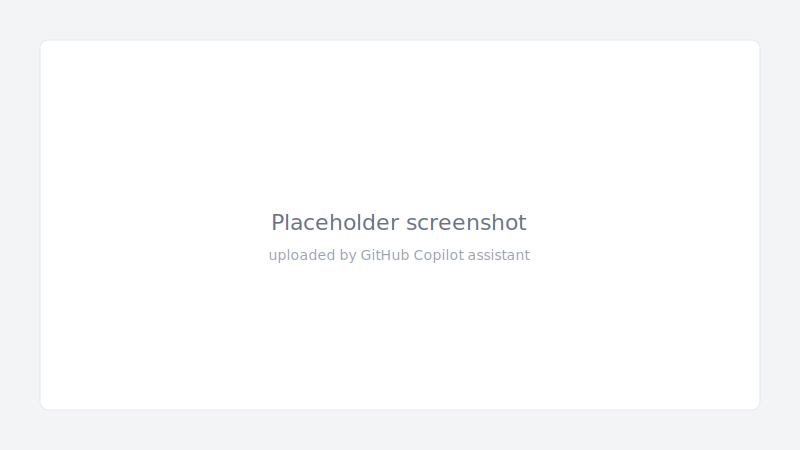
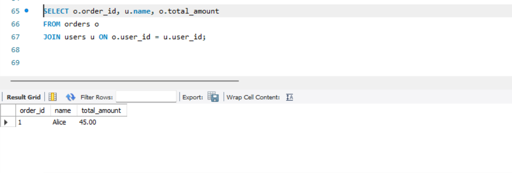
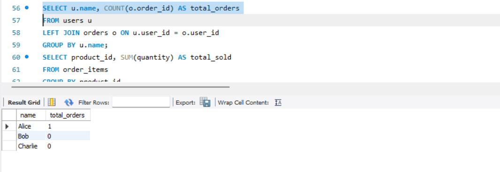
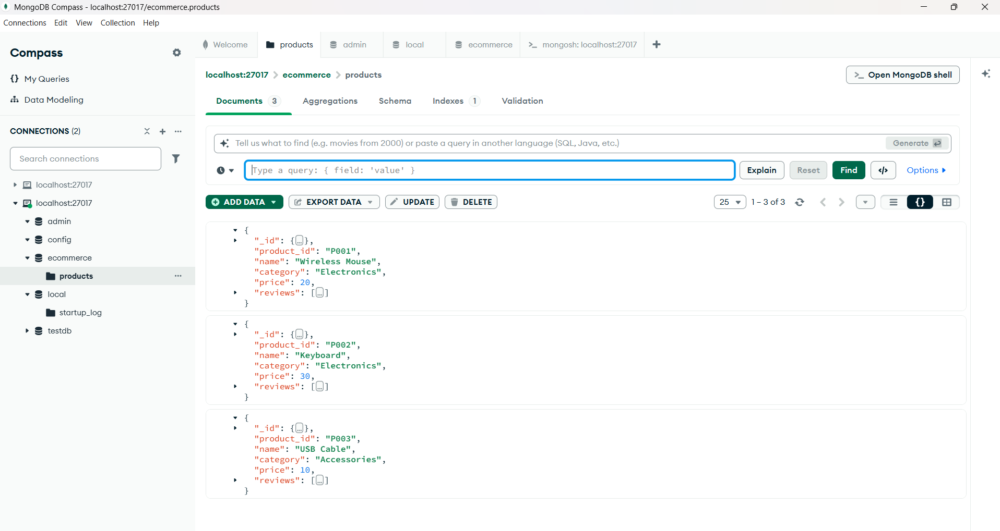
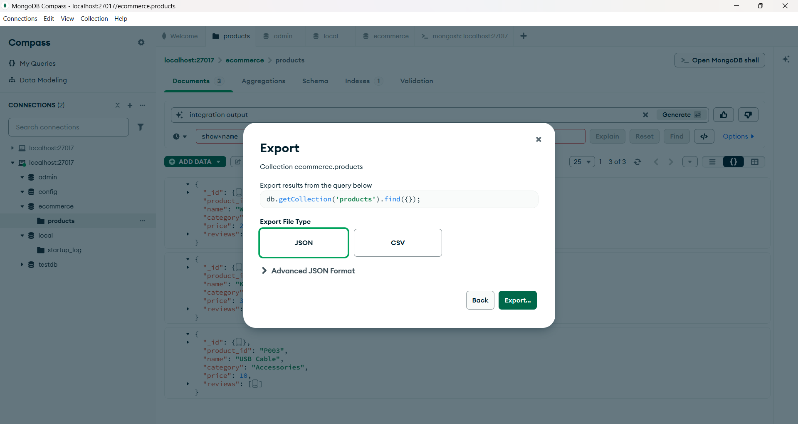

# Screenshots

Below are the screenshots for the ER diagram and example queries/outputs.

## ER diagram

## MySQL screenshots

## MongoDB screenshots

## Integration output

Notes:
- I added a placeholder SVG at docs/screenshots/uploaded_screenshot.svg because you asked me to upload a screenshot. Replace this file with your real PNG/JPG/WebP when you have it by committing the actual image to docs/screenshots/ with the same name or updating the README to point to a different filename.
- If you want me to upload your real image file, please attach it here (upload) and tell me which branch to push to. I can then replace the placeholder with the actual binary image.
